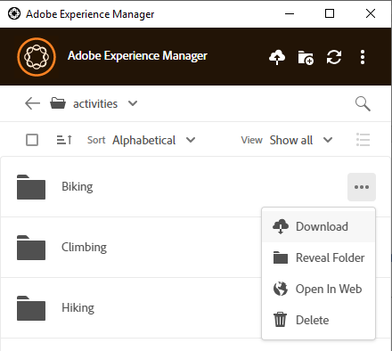

# 로컬로 에셋 다운로드 {#download-assets-locally}

앱은 [!DNL Experience Manager] 서버에서 로컬 파일 시스템으로 자산을 자주 다운로드합니다. 다운로드에는 대역폭과 디스크 공간이 사용됩니다. 시나리오를 알면 다운로드가 완료될 때까지 기다리는 시간을 최적화하는 데 도움이 될 수 있습니다. 로컬 파일 시스템에서 에셋을 다운로드할 수 있습니다. 앱은 [!DNL Experience Manager] 서버에서 자산을 가져와서 로컬 파일 시스템에 동일한 복사본을 저장합니다.

옵션을 보려면 **[!UICONTROL More actions]** 을 클릭하고 다운로드하려면 을 클릭하십시오.

>[!NOTE]
>
>큰 파일 또는 많은 파일을 다운로드하거나 업로드할 때 애플리케이션은 에셋 및 폴더에 대한 작업을 끕니다. 다운로드 또는 업로드가 완료되면 작업을 사용할 수 있습니다.

[!UICONTROL Open] 작업을 사용하여 기본 데스크톱 응용 프로그램에서 자산을 열 때 해당 자산은 로컬에서 아직 사용할 수 없는 경우 로컬로 다운로드됩니다. [자산 열기](#openondesktop-v2)를 참조하세요.

앱 내에서 에셋 또는 폴더의 위치를 표시하면 에셋 또는 폴더가 먼저 로컬로 다운로드된 다음 로컬 네트워크 공유의 시스템에서 열립니다. [자산 열기](#openondesktop-v2)를 참조하세요.

[!UICONTROL Edit] 작업을 사용하여 기본 데스크톱 응용 프로그램에서 자산을 편집할 때 해당 자산은 로컬에서 아직 사용할 수 없는 경우 로컬로 다운로드됩니다. [에셋 편집 및 업데이트된 에셋 업로드 [!DNL Experience Manager]](#edit-assets-upload-updated-assets)를 참조하십시오.

앱이 설치되고 허용되는 경우 [!UICONTROL Desktop Actions] 웹 인터페이스에서 [!DNL Experience Manager]을(를) 사용할 때 작업이 완료됩니다. 앱이 먼저 에셋을 다운로드한 다음 작업을 완료합니다.

## 여러 에셋 다운로드 {#download-multiple-assets}

대기열 크기가 크거나 네트워크 문제가 있는 경우 여러 자산을 다운로드하면 성능이 저하될 수 있습니다. 또한 폴더를 다운로드할 때 모르는 사이에 많은 에셋을 다운로드용으로 대기열에 넣을 수 있습니다. 대기 시간이 길지 않도록 앱에서 한 번에 다운로드되는 에셋 수를 제한합니다. 구성 방법은 [환경 설정 지정](install-upgrade.md#set-preferences)을 참조하세요. 이 제한 미만이더라도 앱이 겉보기에 큰 폴더를 다운로드하기 전에 확인을 요청할 수 있습니다.

폴더를 선택하고 다운로드하면 응용 프로그램은 [!DNL Experience Manager]의 폴더에 직접 저장된 자산만 다운로드합니다. 하위 폴더에서 에셋을 자동으로 다운로드하지는 않습니다.

## 다음 단계 {#next-steps}

* [비디오로 Adobe Experience Manager 데스크톱 앱 시작](https://experienceleague.adobe.com/en/docs/experience-manager-learn/assets/creative-workflows/aem-desktop-app)

* 오른쪽 사이드바에서 사용 가능한 [!UICONTROL Edit this page]  또는 [!UICONTROL Log an issue] 를 사용하여 문서 피드백을 제공하십시오

* [고객 지원 센터](https://experienceleague.adobe.com/?support-solution=General#support) 문의

>[!MORELIKETHIS]
>
>* [자산 업로드](/help/using/upload-assets.md)
>* [사용자 인터페이스 이해](/help/using/user-interface.md)
>* [검색](/help/using/search.md)

