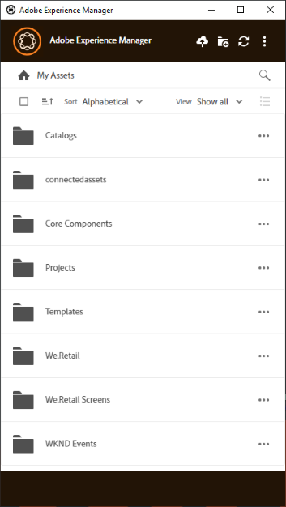

# [!DNL Adobe Experience Manager] 데스크톱 앱 설치 {#install-app-v2}

[!DNL Adobe Experience Manager] 데스크톱 앱을 사용하면 [!DNL Experience Manager] 내의 자산을 로컬 데스크톱에서 쉽게 사용할 수 있으며 모든 기본 데스크톱 응용 프로그램에서 사용할 수 있습니다. Assets은 데스크탑 앱에서 미리 보고 열 수 있습니다. Finder 또는 Explorer에서 문서에 사용할 수 있도록 표시하고 로컬에서 편집할 수 있습니다. 변경 사항이 [!DNL Experience Manager] (으)로 다시 저장되며 업로드 시 새 버전이 만들어집니다.

이러한 통합을 통해 조직의 다양한 역할이 다음을 수행할 수 있습니다.

* [!DNL Experience Manager Assets]에서 중앙에서 자산을 관리합니다.

* 서드파티 애플리케이션 및 Adobe Creative Cloud을 비롯한 모든 기본 데스크탑 애플리케이션의 자산에 액세스합니다. 그러면서도 사용자는 브랜딩을 포함한 다양한 표준을 쉽게 준수할 수 있다.

[!DNL Experience Manager] 데스크톱 앱을 사용하려면:

* [!DNL Experience Manager] 버전이 [!DNL Experience Manager] 데스크톱 앱과 호환되는지 확인하십시오.

* 애플리케이션을 다운로드하여 설치합니다. 아래의 [데스크톱 앱 설치](#install-v2)를 참조하세요.

* 몇 가지 자산을 사용하여 연결을 테스트합니다. [에셋을 검색하고 검색하는 방법](using.md#browse-search-preview-assets)을 참조하세요.

## 시스템 요구 사항, 사전 요구 사항 및 다운로드 링크 {#tech-specs-v2}

자세한 내용은 [[!DNL Experience Manager] 데스크톱 앱 릴리스 정보](release-notes.md)를 참조하세요.

## 이전 버전에서 업그레이드 {#upgrade-from-previous-version}

데스크탑 앱 v1.x의 사용자인 경우 이전 앱과 최신 앱 버전의 차이점과 유사성을 이해합니다. [데스크톱 앱의 새로운 기능](introduction.md#whats-new-v2) 및 [앱 작동 방식](release-notes.md#how-app-works)을 참조하세요.

>[!NOTE]
>
>두 버전의 데스크톱 앱은 컴퓨터에 함께 사용할 수 없습니다. 버전을 설치하기 전에 다른 버전을 제거합니다.

이전 버전의 앱에서 업그레이드하려면 다음 지침을 따르십시오.

1. 업그레이드하기 전에 모든 자산을 동기화하고 변경 내용을 [!DNL Experience Manager]에 업로드하십시오. 따라서 앱을 제거할 때 편집 내용이 손실되지 않습니다.

1. 이전 버전의 앱을 제거합니다. 제거할 때 옵션을 선택하여 캐시를 지웁니다.

1. 컴퓨터를 다시 시작합니다.

1. 최신 앱을 [다운로드](release-notes.md)하고 [설치](#install-v2)하세요. 아래 지침을 따르십시오.

## 설치 {#install-v2}

데스크탑 앱을 설치하려면 다음 단계를 따르십시오. 최신 앱을 설치하기 전에 기존 Adobe [!DNL Experience Manager] 데스크톱 앱 v1.x를 제거하십시오. 자세한 정보는 위를 참조하십시오.

1. [릴리스 정보](release-notes.md) 페이지에서 최신 설치 관리자를 다운로드하십시오.

1. [!DNL Experience Manager] 배포의 URL 및 자격 증명을 가까이 보관하십시오.

1. 다른 버전의 앱에서 업그레이드하는 경우 [데스크톱 앱 업그레이드](#upgrade-from-previous-version)를 참조하십시오.

1. [!DNL Experience Manager]을(를) [!DNL Cloud Service], [!DNL Experience Manager] 6.4.4 이상 또는 [!DNL Experience Manager] 6.5.0 이상으로 사용하는 경우 이 단계를 건너뜁니다. [!DNL Experience Manager] 설정이 [릴리스 정보](release-notes.md)에 언급된 호환성 요구 사항을 충족하는지 확인하십시오. 필요한 경우 해당 [호환성 패키지](https://experience.adobe.com/#/downloads/content/software-distribution/en/aem.html?package=/content/software-distribution/en/details.html/content/dam/aem/public/adobe/packages/cq640/featurepack/adobe-asset-link-support)를 다운로드하고 [!DNL Experience Manager] 패키지 관리자를 사용하여 [!DNL Experience Manager] 관리자로 설치하십시오. 패키지를 설치하려면 [패키지를 사용하여 작업하는 방법](https://experienceleague.adobe.com/ko/docs/experience-manager-65/content/sites/administering/contentmanagement/package-manager)을 참조하세요.

1. 설치 관리자 바이너리를 실행하고 화면의 지침에 따라 설치합니다.

1. Windows에서는 `Visual Studio C++ Redistributable 2015`을(를) 설치하라는 메시지가 나타날 수 있습니다. 화면의 지침에 따라 설치합니다. 설치에 실패한 경우 수동으로 설치합니다. [여기](https://www.microsoft.com/en-us/download/details.aspx?id=52685)에서 설치 관리자를 다운로드하고 `vc_redist.x64.exe` 및 `vc_redist.x86.exe` 파일을 모두 설치하십시오. [!DNL Experience Manager] 데스크톱 앱 설치 관리자를 다시 실행합니다.

1. 메시지가 표시되면 컴퓨터를 다시 시작합니다. 데스크탑 앱을 실행하고 구성합니다.

1. 앱을 [!DNL Experience Manager] 리포지토리와 연결하려면 트레이에서 앱 아이콘을 클릭하고 앱을 실행합니다. [!DNL Experience Manager] 서버의 주소를 `https://[aem_server]:[port]/` 형식으로 제공하십시오.

   **[!UICONTROL Connect]**&#x200B;을(를) 클릭하고 자격 증명을 제공합니다.

   

   *그림: 서버 주소를 입력하는 연결 화면*

   데스크톱 앱에 로그온할 때마다 연결 세부 정보를 입력하지 않으려면 **[!UICONTROL Remember Connection]**&#x200B;을(를) 선택하십시오.

   >[!CAUTION]
   >
   >[!DNL Experience Manager] 서버의 주소 앞이나 뒤에 선행 또는 후행 공백이 없는지 확인하십시오. 그렇지 않으면 앱을 [!DNL Experience Manager] 서버에 연결할 수 없습니다.

1. [선택 사항] **[!UICONTROL I want to connect a different way]**&#x200B;을(를) 클릭하고 **[!UICONTROL Adobe login]**&#x200B;을(를) 클릭하여 Adobe Identity Management 서비스(IMS)를 사용하여 Experience Manager Assets 서버에 로그온합니다. IMS 로그온을 사용하면 데스크탑 앱에서 액세스 토큰 새로 고침을 자동으로 수행하여 사용자가 최대 14일 동안 로그온한 상태를 유지할 수 있습니다. 사용자의 자격 증명을 사용하여 [!DNL Experience Manager] 서버에 표준 로그온하려면 **[!UICONTROL Direct login]**&#x200B;을(를) 클릭합니다.

   

1. 연결에 성공하면 [!DNL Experience Manager] DAM의 루트 폴더에서 사용할 수 있는 폴더 및 자산 목록을 볼 수 있습니다. 앱 내에서 폴더를 검색할 수 있습니다.

   

   *그림: 로그인 후 응용 프로그램에서 DAM 내용을 표시합니다*

1. ([!DNL Experience Manager] 6.5.1 이상) 데스크톱 앱을 [!DNL Experience Manager] 6.5.1 이상에서 사용하는 경우 S3 또는 Azure 커넥터를 버전 1.10.4 이상으로 업그레이드하십시오. [Azure 커넥터](https://experienceleague.adobe.com/ko/docs/experience-manager-65/content/implementing/deploying/deploying/data-store-config#azure-data-store) 또는 [S3 커넥터](https://experienceleague.adobe.com/ko/docs/experience-manager-65/content/implementing/deploying/deploying/data-store-config#amazon-s-data-store)를 참조하세요.

   Adobe Managed Services(AMS) 고객인 경우 Adobe 고객 지원 센터에 문의하십시오.

## 환경 설정 지정 {#set-preferences}

환경 설정을 변경하려면  및 **[!UICONTROL Preference]** 을 클릭하세요. **[!UICONTROL Preferences]** 창에서 다음 값을 조정합니다.

* [!UICONTROL Launch the application on logon]

* [!UICONTROL Show a window when the application starts]

* **[!UICONTROL Cache Directory]**: 앱의 로컬 캐시 위치(로컬로 다운로드한 자산이 포함되어 있음).

* **[!UICONTROL Network Drive Letter]**: [!DNL Experience Manager] DAM에 매핑하는 데 사용되는 드라이브 문자입니다. 확실하지 않은 경우 이 네트워크 드라이브 문자를 변경하지 마십시오. 앱은 Windows의 모든 드라이브 문자에 매핑할 수 있습니다. 두 사용자가 서로 다른 드라이브 문자의 자산을 배치하면 서로 다른 사용자가 배치한 자산을 볼 수 없습니다. 에셋의 경로가 변경됩니다. 에셋은 바이너리 파일(예: INDD)에 계속 배치되며 제거되지 않습니다. 앱은 사용 가능한 모든 드라이브 문자를 나열하며 기본적으로 사용 가능한 마지막 문자(일반적으로 `Z`)를 사용합니다.

* **[!UICONTROL Maximum Cache Size]**: 로컬로 다운로드한 자산을 저장하는 데 사용되는 하드 디스크의 허용된 캐시(GB)입니다.

* **[!UICONTROL Current cache size]**: 로컬로 다운로드한 자산의 저장소 크기입니다. 앱을 사용하여 에셋을 다운로드한 후에만 정보가 표시됩니다.

* **[!UICONTROL Automatically download linked assets]**: 원본 파일을 다운로드하면 지원되는 기본 Creative Cloud 앱에 있는 자산을 자동으로 가져옵니다.

* **[!UICONTROL Maximum number of downloads]**:  주의해서 변경합니다. 처음 에셋을 다운로드할 때(표시, 열기, 편집, 다운로드 또는 이와 유사한 옵션을 통해) 에셋은 배치에 이 숫자 미만이 포함된 경우에만 다운로드됩니다. 기본값은 50입니다. 확실하지 않은 경우 변경하지 마십시오. 값을 높이면 대기 시간이 길어질 수 있지만, 값을 낮추면 필요한 모든 에셋 또는 폴더를 한 번에 다운로드하지 못할 수 있습니다.

* **[!UICONTROL Use legacy conventions when creating nodes for assets and folders]**:  주의해서 변경합니다. 이 설정을 사용하면 폴더를 업로드할 때 앱이 v1.10 앱 동작을 에뮬레이션할 수 있습니다. v1.10에서 저장소에서 생성된 노드 이름은 사용자가 제공한 폴더 이름의 공백 및 대소문자를 따릅니다. 그러나 앱 v2.1에서는 폴더 이름의 추가 공백이 대시로 변환됩니다. 예를 들어 옵션을 선택하지 않고 v2.1의 기본 동작이 유지된 경우 `New Folder` 또는 `new   folder`을(를) 업로드하면 저장소에 동일한 노드가 만들어집니다. 이 옵션을 선택하면 위의 두 폴더에 대해 저장소에 다른 노드가 만들어지고 v1.10 앱의 동작과 일치합니다.

  v2.1의 기본 동작은 변경되지 않습니다. 폴더 이름의 여러 공백을 저장소 노드 이름의 대시로 바꾸고 노드 이름을 소문자로 변환합니다.

* **[!UICONTROL Upload Acceleration]**:  주의해서 변경합니다. 에셋을 업로드할 때 애플리케이션에서 동시 업로드를 사용하여 업로드 속도를 향상시킬 수 있습니다. 슬라이더를 오른쪽으로 이동하여 업로드의 동시성을 높일 수 있습니다. 맨 왼쪽에 있는 슬라이더는 동시성(단일 스레드 업로드)이 없음을 의미하며, 중간 위치는 10개의 동시 스레드에 해당하며, 맨 오른쪽에 있는 최대 제한은 20개의 동시 스레드에 해당합니다. 동시성 제한이 높을수록 리소스가 많이 사용됩니다.

사용할 수 없는 기본 설정을 업데이트하려면 [!DNL Experience Manager] 서버에서 로그아웃한 다음 업데이트하십시오. 환경 설정을 업데이트한 후 을 클릭합니다.


*그림: 데스크톱 앱 환경 설정*

### 프록시 지원 {#proxy-support}

[!DNL Experience Manager] 데스크톱 앱은 시스템의 사전 정의된 프록시를 사용하여 HTTPS를 통해 인터넷에 연결합니다. 앱은 추가 인증이 필요하지 않은 네트워크 프록시만 사용하여 연결할 수 있습니다.

Windows용 프록시 서버 설정(인터넷 옵션 > LAN 설정)을 구성하거나 수정하는 경우 [!DNL Experience Manager] 데스크톱 앱을 다시 시작하여 변경 내용을 적용하십시오. 프록시 구성은 데스크탑 앱을 시작할 때 적용됩니다. 변경 사항을 적용하려면 앱을 닫았다가 다시 실행하십시오.

프록시에 인증이 필요한 경우 IT 팀은 프록시 서버 설정에서 [!DNL Experience Manager Assets] URL을 허용하여 응용 프로그램 트래픽을 전달할 수 있도록 할 수 있습니다.

## 앱 제거 {#uninstall-the-app}

Windows에서 응용 프로그램을 제거하려면 다음 단계를 수행하십시오.

1. 편집 내용이 손실되지 않도록 모든 변경 내용을 [!DNL Experience Manager]에 업로드하십시오. [에셋 편집 및 업데이트된 에셋 업로드 [!DNL Experience Manager]](using.md#edit-assets-upload-updated-assets)를 참조하십시오. 로그오프하고 앱을 [!UICONTROL Exit]합니다.

1. 다른 OS 응용 프로그램을 제거하는 것처럼 앱을 제거합니다. Windows의 프로그램 추가 및 제거에서 제거 합니다.

1. 캐시와 로그를 제거하려면 필요한 확인란을 선택합니다.

   

1. 화면의 지시를 따릅니다. 완료되면 컴퓨터를 다시 시작합니다.

Mac에서 애플리케이션을 제거하려면 다음 단계를 따르십시오.

1. 편집 내용이 손실되지 않도록 모든 변경 내용을 [!DNL Experience Manager]에 업로드하십시오. [에셋 편집 및 업데이트된 에셋 업로드 [!DNL Experience Manager]](using.md#edit-assets-upload-updated-assets)를 참조하십시오. 로그오프하고 앱을 [!UICONTROL Exit]합니다.

1. `/Applications`에서 `Adobe Experience Manager Desktop.app`을(를) 제거합니다.

또는 Mac에서 내부 애플리케이션 캐시를 지우고 앱을 제거하려면 터미널에서 다음 명령을 실행할 수 있습니다.

```shell
/Applications/Adobe Experience Manager Desktop/Contents/Resources/uninstall-osx/uninstall.sh
```
