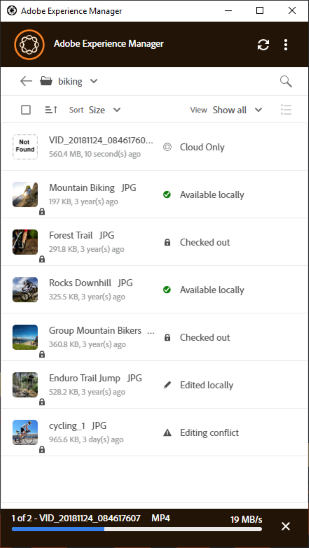

# 에셋 검색 및 미리 보기 {#browse-search-preview-assets}

데스크톱 응용 프로그램 내에서 [!DNL Experience Manager] 저장소에서 사용 가능한 자산을 모두 찾아보고 검색하고 미리 볼 수 있습니다. 앱에서 다음을 시도해 보십시오.

1. 폴더를 탐색하여 모든 에셋의 작은 썸네일과 함께 폴더에서 사용할 수 있는 에셋에 대한 몇 가지 기본 정보를 확인합니다.

   

1. 개별 에셋에 대한 더 많은 정보와 더 큰 썸네일을 보려면 파일 이름을 클릭합니다.

   

1. 로컬로 파일을 다운로드하고 기본 응용 프로그램에서 보거나 편집하려면 **[!UICONTROL Open]** 또는 **[!UICONTROL Edit]**&#x200B;을(를) 각각 클릭하십시오.
1. 키워드를 사용하여 검색하여 [!DNL Experience Manager] 저장소에서 관련 자산을 찾습니다. `?` 및 `*`을(를) 와일드카드로 사용합니다. 이러한 와일드카드는 각각 단일 문자 또는 여러 문자를 대체합니다. 필요에 따라 결과를 필터링하고 정렬합니다.

   

   

>[!NOTE]
>
>이 앱은 에셋의 제목이나 파일 이름뿐만 아니라 여러 메타데이터 필드에서 검색 기준을 일치시켜 에셋을 표시합니다.

## 데스크탑에서 자산 열기 {#openondesktop-v2}

기본 애플리케이션에서 볼 원격 자산을 열 수 있습니다. 자산이 로컬 폴더로 다운로드됩니다. 그런 다음 파일 형식과 연결된 기본 애플리케이션에서 실행됩니다. 기본 응용 프로그램을 변경하여 Mac 또는 Windows에서 특정 파일 형식(확장명)을 열 수 있습니다.

자산 메뉴에서 **[!UICONTROL Open]**&#x200B;을(를) 클릭합니다. 에셋이 로컬로 다운로드되고 기본 애플리케이션에서 열립니다. 상태 표시줄에서 대형 에셋의 다운로드 진행률 및 전송 속도를 확인합니다.

<!-- 
-->

>[!NOTE]
>
>예상되는 변경 내용이 앱에 반영되지 않으면 새로 고침 아이콘 을 클릭하거나 앱 인터페이스를 마우스 오른쪽 단추로 클릭하고 **[!UICONTROL Refresh]**&#x200B;을(를) 클릭합니다. 더 큰 규모의 다운로드나 업로드가 진행되는 동안에는 작업을 사용할 수 없습니다.

에셋의 로컬 다운로드 폴더를 열려면 을 클릭하고  **[!UICONTROL Reveal File]** 작업을 클릭합니다.

## 기본 문서에 에셋 사용 또는 배치 {#place-assets-in-native-documents}

경우에 따라 에셋을 기본 문서에 배치할 때 Windows 탐색기 또는 Mac Finder의 파일에 액세스합니다. 로컬로 다운로드한 파일의 파일 시스템 위치로 이동하려면  **[!UICONTROL Reveal File]** 옵션을 사용합니다.

로컬 컴퓨터에서 파일 또는 폴더를 미리 선택한 상태로 Windows 탐색기 또는 Mac Finder를 열려면 **[!UICONTROL Reveal File]** 또는 **[!UICONTROL Reveal Folder]**&#x200B;을(를) 클릭합니다. 예를 들어 이 옵션은 로컬 파일 배치 또는 연결을 지원하는 기본 응용 프로그램에 [!DNL Experience Manager] 파일을 배치하는 데 유용합니다. Adobe InDesign에 파일을 배치하는 방법을 보려면 [그래픽 배치](https://helpx.adobe.com/indesign/using/placing-graphics.html)를 참조하십시오.

**[!UICONTROL Reveal File]** 작업은 로컬 네트워크 공유를 엽니다. 로컬에서 사용할 수 있는 에셋만 표시됩니다. 즉, 앱을 사용하여 공개, 다운로드 또는 열기/편집한 에셋을 표시합니다. 로컬 네트워크 공유가 [!DNL Experience Manager]에 변경 내용을 업로드하지 않습니다. 변경 내용을 업로드하려면 앱에서 **[!UICONTROL Upload Changes]** 또는 **[!UICONTROL Upload]** 작업을 명시적으로 사용하십시오.

>[!NOTE]
>
>[!DNL Experience Manager] 데스크톱 앱 v1.x와의 이전 버전과의 호환성을 위해, 로컬 네트워크 공유에서 표시된 파일을 제공하고 로컬에서 사용 가능한 파일만 노출합니다. 표시된 파일의 데스크탑 경로는 앱 v1.x에서 만든 경로와 동일합니다.

>[!CAUTION]
>
>기본 응용 프로그램에서 자산을 편집할 때 **[!UICONTROL Reveal File]** 옵션을 사용하지 마십시오. 대신 **[!UICONTROL Edit]** 작업을 사용하십시오. 자세한 내용은 [고급 워크플로: 동일한 파일에 대해 공동 작업 및 편집 충돌 방지](#adv-workflow-collaborate-avoid-conflicts)를 참조하십시오.

### 자산 이름의 특수 문자 관리 {#special-characters-in-filename}

레거시 앱에서 리포지토리에서 만든 노드 이름은 사용자가 제공한 폴더 이름의 공백과 대/소문자를 유지합니다. 현재 응용 프로그램에서 v1.10 앱의 노드 이름 지정 규칙을 에뮬레이션하려면 [!UICONTROL Use legacy conventions when creating nodes for assets and folders]에서 [!UICONTROL Preferences]을(를) 사용하도록 설정하십시오. [앱 환경 설정](/help/using/install-upgrade.md#set-preferences)을 참조하세요. 이 레거시 환경 설정은 기본적으로 비활성화되어 있습니다.

>[!NOTE]
>
>이 앱은 다음 이름 지정 규칙을 사용하여 저장소의 노드 이름만 변경합니다. 앱에서 자산의 `Title`을(를) 그대로 유지합니다.

| 문자 ‡ | 앱의 이전 환경 설정 | 파일 이름에 발생할 때 | 폴더 이름에서 발생하는 경우 | 예 |
|---|---|---|---|---|
| `. / : [ ] \| *` | 활성화 또는 비활성화 | `-`(하이픈)으로 대체되었습니다. 파일 이름 확장명의 `.`(점)은 그대로 유지됩니다. | `-`(하이픈)으로 대체되었습니다. | `myimage.jpg`은(는) 그대로 유지되며 `my.image.jpg`이(가) `my-image.jpg`(으)로 변경됩니다. |
| `% ; # , + ? ^ { } "` 및 공백 |  비활성화됨 | 공백은 유지됩니다 | `-`(하이픈)으로 대체되었습니다. | `My Folder.`에서 `my-folder-`(으)로 변경되었습니다. |
| `# % { } ? & .` |  비활성화됨 | `-`(하이픈)으로 대체되었습니다. | 나. | `#My New File.`에서 `-My New File-`(으)로 변경되었습니다. |
| 대문자 |  비활성화됨 | 케이스는 그대로 유지됩니다. | 소문자로 변경되었습니다. | `My New Folder`에서 `my-new-folder`(으)로 변경되었습니다. |
| 대문자 |  활성화됨 | 케이스는 그대로 유지됩니다. | 케이스는 그대로 유지됩니다. | 나. |

‡ 문자 목록은 공백으로 구분된 목록입니다.

## 편집된 모든 이미지 찾기 {#find-all-edited-images}

이 응용 프로그램에서는 로컬에서 다운로드한 다음 수정한 모든 파일에 빠르게 액세스할 수 있도록 **[!UICONTROL Edited locally]**(이)라는 보기를 제공합니다([!UICONTROL Open] 또는 [!UICONTROL Edit] 작업 사용). 앱을 사용하면 몇 번의 클릭으로 로컬에서 편집한 모든 자산을 선택하고 변경 사항을 업로드할 수 있습니다. 이 보기는 편집 충돌이 있는 로컬로 편집된 에셋도 표시합니다.

## 다음 단계 {#next-steps}

* [비디오로 Adobe Experience Manager 데스크톱 앱 시작](https://experienceleague.adobe.com/en/docs/experience-manager-learn/assets/creative-workflows/aem-desktop-app)

* 오른쪽 사이드바에서 사용 가능한 [!UICONTROL Edit this page]  또는 [!UICONTROL Log an issue] 를 사용하여 문서 피드백을 제공하십시오

* [고객 지원 센터](https://experienceleague.adobe.com/?support-solution=General#support) 문의

>[!MORELIKETHIS]
>
>* [사용자 인터페이스 이해](/help/using/user-interface.md)
>* [데스크톱 앱 사용](/help/using/using-desktop-app.md)
>* [데스크톱 앱에서 Assets 관리](/help/using/assets-management-tasks.md)
