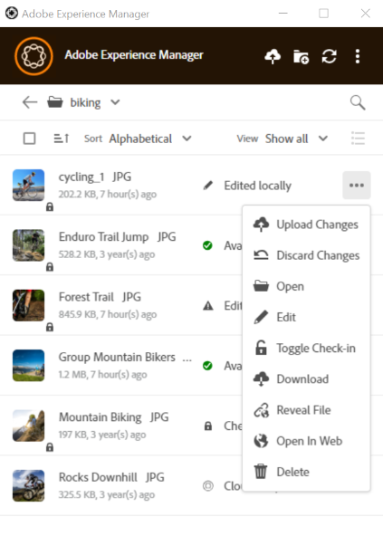

# 자산 업로드 {#upload-assets}

에셋을 추가할 수 있는 권한이 있는 AEM Desktop App 사용자는 에셋(예: 이미지, 문서, 비디오 또는 기타 미디어)을 추가할 수 있습니다.

## 에셋을 편집하고 업데이트된 에셋을 [!DNL Experience Manager]에 업로드 {#edit-assets-upload-updated-assets}

변경한 후 업데이트된 자산을 [!DNL Experience Manager] 서버에 업로드하려면 편집할 자산을 여십시오. 다른 사용자의 편집과 충돌을 방지하려면 앱을 사용하여 편집 세션을 시작하십시오. 편집을 시작하기 전에 에셋에 다른 사용자가 에셋을 편집하고 있음을 나타내는 잠금 아이콘이 없는지 확인합니다.

에셋을 편집하려면 에셋을 검색하거나 에셋의 위치를 찾습니다. 을 클릭하고 **[!UICONTROL Edit]**&#x200B;을(를) 클릭합니다.

다음 두 상황에서 다른 사용자의 편집과 충돌하지 않도록 자산을 잠그려면 **[!UICONTROL Toggle Check-out]**&#x200B;을(를) 사용하십시오.

* 자산을 먼저 체크아웃하지 않고 편집을 시작했습니다(자산을 열기만 하면 됨).
* 에셋 편집을 곧 시작하고 다른 사용자가 편집하지 않도록 하려는 경우

편집을 완료하면 변경된 에셋에 대한 **[!UICONTROL Edited Locally]** 상태가 앱에 표시됩니다. 변경 내용을 [!DNL Experience Manager]에 업로드할 때까지 자산에 저장된 모든 변경 내용이 로컬 전용입니다. 개별 또는 몇 개의 에셋을 하나씩 업로드하려면 에셋 옵션에서 **[!UICONTROL Upload Changes]**&#x200B;을(를) 클릭합니다. [!DNL Experience Manager]에 자산의 버전을 만듭니다. [!DNL Assets]의 웹 인터페이스를 사용하면 [타임라인 보기](https://experienceleague.adobe.com/ko/docs/experience-manager-65/content/assets/using/activity-stream)에서 자산 내역을 볼 수 있습니다.

공동 편집에 대한 모범 사례는 [고급 워크플로우: 동일한 파일에 대해 공동 작업하고 편집 충돌을 피하십시오](#adv-workflow-collaborate-avoid-conflicts)를 참조하십시오.

다음과 같은 경우 로컬 자산에 대한 변경 사항 및 편집 내용을 취소할 수 있습니다. **[!UICONTROL Discard Changes]**&#x200B;를 클릭합니다.

* 변경 내용을 [!DNL Experience Manager]에 로컬로 저장하지 않으려는 경우
* 일부 변경 내용을 저장한 후 원래 에셋에서 변경 작업을 시작합니다.
* 더 이상 필요하지 않으므로 자산 편집을 중지합니다.

필요한 경우 체크 아웃을 전환합니다. 업데이트된 자산은 로컬 캐시 폴더에서 제거되고, 편집하거나 열 때 다시 다운로드됩니다.

## [!DNL Experience Manager]에 새 자산 업로드 및 추가 {#upload-and-add-new-assets-to-aem}

사용자는 DAM 저장소에 새 에셋을 추가할 수 있습니다. 예를 들어 사진 촬영에서 [!DNL Experience Manager] 리포지토리에 많은 사진을 추가하려는 에이전시 사진작가 또는 계약자일 수 있습니다. [!DNL Experience Manager]에 새 콘텐츠를 추가하려면 앱의 상단 표시줄에서 을 선택합니다. 로컬 파일 시스템에서 자산 파일을 찾은 다음 **[!UICONTROL Select]**&#x200B;을(를) 클릭합니다. 또는 에셋을 업로드하려면 애플리케이션 인터페이스에서 파일이나 폴더를 드래그합니다. Windows에서 앱 내의 폴더에 자산을 드래그하면 자산이 폴더에 업로드됩니다. 업로드하는 데 시간이 오래 걸리는 경우 앱에 진행률 표시줄이 표시됩니다.

<!-- 
-->

로컬 파일 시스템에서 폴더 또는 개별 파일을 업로드할 수 있습니다. 업로드 시 폴더의 계층 구조가 유지됩니다. 자산을 일괄적으로 업로드하기 전에 [일괄 업로드](#bulk-upload-assets)를 참조하십시오.

특정 세션에서 전송된 자산 목록을 보려면 **[!UICONTROL View]** > **[!UICONTROL Assets transfers]**&#x200B;을(를) 클릭합니다. 목록을 사용하면 현재 세션의 파일 전송을 보고 신속하게 확인할 수 있습니다.

**[!UICONTROL Preferences]** > **[!UICONTROL Upload acceleration]** 설정에서 업로드 동시성(가속)을 제어할 수 있습니다. 동시성이 높으면 일반적으로 업로드 속도가 빨라지지만 리소스가 많이 소모되고 로컬 컴퓨터의 처리 능력이 더 많이 소모될 수 있습니다. 시스템이 느려진 경우 더 낮은 동시성 값을 사용하여 업로드를 다시 시도합니다.

>[!NOTE]
>
>전송 목록이 지속적이지 않으며 앱을 종료한 후 다시 열면 사용할 수 없습니다.

## 자산 일괄 업로드 {#bulk-upload-assets}

사진작가나 광고 기획사와 같은 사용자 또는 조직은 사진 촬영, 리터치 또는 더 큰 세트에서 선택 등의 활동 중에 수많은 지역 자산을 만들 수 있습니다. 이러한 작업은 대개 [!DNL Experience Manager] 외부에서 수행됩니다. 이러한 대용량 로컬 폴더를 데스크톱 앱에서 바로 [!DNL Assets]에 업로드할 수 있습니다. 폴더 계층은 유지되고 중첩된 모든 하위 폴더와 포함된 에셋이 업로드됩니다. 업로드된 에셋은 동일한 서버의 다른 사용자도 즉시 사용할 수 있습니다. Assets은 백그라운드에서 업로드되므로 작업이 웹 브라우저 세션에 연결되어 있지 않습니다.

![데스크톱에서 여러 로컬 폴더를 [!DNL Experience Manager]](assets/upload_local_folders_da2.png "데스크톱에서 여러 로컬 폴더를 Experience Manager으로 일괄 업로드")

업로드한 후 예상되는 변경 내용이 앱에 반영되지 않으면 새로 고침 아이콘 을 클릭합니다.

>[!NOTE]
>
>업로드 기능을 사용하여 두 개의 [!DNL Experience Manager] 배포 간에 자산을 마이그레이션하지 마십시오. 대신 [마이그레이션 안내서](https://experienceleague.adobe.com/ko/docs/experience-manager-65/content/assets/administer/assets-migration-guide)를 참조하세요.

## 다음 단계 {#next-steps}

* [비디오로 Adobe Experience Manager 데스크톱 앱 시작](https://experienceleague.adobe.com/ko/docs/experience-manager-learn/assets/creative-workflows/aem-desktop-app)

* 오른쪽 사이드바에서 사용 가능한 [!UICONTROL Edit this page]  또는 [!UICONTROL Log an issue] 를 사용하여 문서 피드백을 제공하십시오

* [고객 지원 센터](https://experienceleague.adobe.com/ko?support-solution=General#support) 문의

>[!MORELIKETHIS]
>
>* [자산 다운로드](/help/using/download-assets.md)
>* [사용자 인터페이스 이해](/help/using/user-interface.md)
>* [검색](/help/using/search.md)
