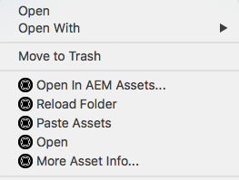

# [!DNL Experience Manager] 데스크톱 앱 v1.10 사용 {#use-aem-desktop-app-v1x}

앱을 사용하면 로컬 데스크톱에서 [!DNL Experience Manager] 내의 자산에 쉽게 액세스할 수 있으며 모든 데스크톱 응용 프로그램에서 사용할 수 있습니다. Assets은 Mac Finder 또는 Windows 탐색기에서 쉽게 볼 수 있으며 데스크톱 응용 프로그램에서 열리고 로컬로 변경될 수 있습니다. 변경 사항은 리포지토리에 새 버전을 만들어 [!DNL Experience Manager]에 다시 저장됩니다.

이러한 통합을 통해 Creative Cloud 및 기타 애플리케이션 전반에 걸쳐 중앙 집중식 자산 관리 및 액세스가 가능하여 브랜딩 및 기타 표준 준수를 보장할 수 있습니다.

[!DNL Experience Manager] 데스크톱 앱 v1을 사용하여 수행하는 주요 작업은 다음과 같습니다.

1. [ [!DNL Experience Manager] 서버와 연결](#installandconnect)
1. [데스크탑 앱에서 바로 자산 열기](#openondesktop)
1. [데스크탑 앱에서 자산 편집 및 체크아웃](#workonassets)
1. [에셋 및 폴더 일괄 업로드](#bulkupload)

다양한 권장 할 수 있는 방법 및 할 수 없는 방법에 대해서는 [데스크톱 앱 사용 모범 사례](best-practices-for-v1.md)를 참조하세요. 앱을 사용하는 데 문제가 있는 경우 [문제 해결 [!DNL Experience Manager] 데스크톱 앱](troubleshoot-app-v1.md)을 수행하는 방법을 참조하세요.

>[!NOTE]
>
>데스크톱 앱은 [!DNL Experience Manager] 6.1 릴리스에 도입되었으며 [!DNL Experience Manager Assets Companion App] (으)로 호출되었습니다.

## 크리에이티브 워크플로의 데스크톱 앱 터치포인트 [!DNL Experience Manager]개 {#aem-desktop-app-touch-points-in-the-creative-workflow}

[!DNL Experience Manager] 데스크톱 앱은 [!DNL Assets]과(와) 함께 Creative Workflow에 통합되어 다음 터치 포인트를 제공합니다.

![[!DNL Experience Manager] 데스크탑 앱 터치포인트가 크리에이티브 워크플로우를 가리킵니다](assets/aem_desktopapp_workflow.png)

[!DNL Experience Manager] 데스크탑 앱 터치포인트가 크리에이티브 워크플로우를 가리킵니다.

## 앱을 설치하고 [!DNL Experience Manager] 서버에 연결 {#installandconnect}

크리에이티브 에셋을 만들거나 편집하려면 먼저 데스크톱 응용 프로그램을 [!DNL Assets] 서버와 연결하여 저장소의 에셋을 다운로드하고 업로드하십시오. 다음 작업을 수행합니다.

1. [앱을 설치](#installapp)합니다.
1. [환경 설정](#inapppref) 및 연결 세부 정보를 설정합니다.
1. [서버에 연결 [!DNL Experience Manager] 서버](#connect)하고 자산 저장소를 로컬 드라이브로 탑재합니다.
1. [!DNL Experience Manager] 서버에서 [데스크톱 작업을 사용](#desktopactions)합니다.

[!DNL Experience Manager] 데스크톱 앱은 HTTPS 연결을 사용하여 [!DNL Experience Manager] 서버에 연결하여 자산을 강력하고 안전하게 전송합니다.

>[!NOTE]
>
>설치 및 구성 단계의 전체 또는 일부에 대해 [!DNL Experience Manager] 관리자 또는 시스템 관리자의 도움이 필요할 수 있습니다.

### 애플리케이션 설치 {#installapp}

앱이 Experience Manager 데스크탑 앱을 사용하기 위해 사용 중인 Experience Manager 서버 버전을 지원하는지 확인합니다. 운영 체제(Mac 또는 Windows)에 적합한 설치 파일(바이너리)을 다운로드하고 앱을 설치합니다.

네트워크 및 시스템 기본 설정에 따라 세부 구성이 필요할 수 있습니다. 자세한 내용은 [데스크톱 앱 설치 및 구성 [!DNL Experience Manager] 을 참조하십시오](install-configure-app-v1.md).

1. [[!DNL Experience Manager] 데스크톱 앱 v1.10 다운로드 페이지](/help/using/release-notes-of-v1.md)(으)로 이동하여 운영 체제에 맞는 바이너리를 다운로드합니다.
1. 다운로드한 설치 파일을 실행하고 화면의 지침에 따라 앱을 설치합니다.

   >[!NOTE]
   >
   >[!DNL Experience Manager] 데스크톱 앱의 인스턴스는 한 번에 하나만 설치하고 활성화할 수 있습니다.

### 인앱 옵션 및 환경 설정 이해 {#inapppref}

응용 프로그램을 통해 [!DNL Experience Manager] 서버에 연결 및 연결 끊기, 업로드 상태 보기, 로컬 캐시 관리 등의 설정을 수행할 수 있습니다. 기본 설정은 응용 프로그램의 일반 사용자에 대해 작동합니다. 설정을 수정하여 애플리케이션을 최대한 활용할 수 있습니다. [!DNL Experience Manager] 서버와의 통합을 통해 더 많은 기능을 사용할 수 있습니다. 다음은 다양한 설정입니다.

**Assets 탐색** [!DNL Assets] 리포지토리가 탑재된 로컬 드라이브를 엽니다. 즉, 이제 로컬 컴퓨터에서 사용할 수 있게 된 자산을 살펴봅니다.

**에셋 상태 보기** 변경된 에셋을 업로드하거나 새 에셋을 [!DNL Assets] 저장소에 추가하면 백그라운드에서 에셋이 업로드됩니다. 백그라운드 업로드를 사용하면 특히 크기가 큰 에셋의 경우 업로드가 완료될 때까지 기다리지 않고도 매끄러운 작업을 수행할 수 있습니다. 변경 내용을 로컬에 저장하고 삭제할 수 있습니다. 애플리케이션은 사용 가능한 대역폭에 따라 이러한 에셋을 서버로 전송하는 데 시간이 소요됩니다. 몇 가지 기본 정보와 함께 업로드 상태를 확인할 수 있습니다.

**옵션** 시작 시 앱을 실행하도록 설정하고, 실행 시 [!DNL Experience Manager] 서버에 연결하고, 탑재 후 [!DNL Assets]에 대한 로컬 드라이브 문자를 변경하려면 데스크톱 앱 트레이의 옵션을 클릭하십시오.

**고급 > 캐시 관리** 로컬 캐싱에 사용할 수 있는 디스크 공간을 제어할 수 있습니다. [!DNL Assets] 서버의 아티팩트가 더 원활한 경험을 위해 로컬로 캐시됩니다. 요구 사항에 맞게 기본값을 변경할 수 있습니다. 또한 캐시를 지우면 모든 에셋을 새로 가져올 수 있습니다. 캐시를 지우면 저장되지 않은 변경 사항이 유지됩니다. [!DNL Experience Manager] 서버에 체크 인되지 않은 자산은 유지되며 삭제되지 않습니다.

### [!DNL Experience Manager] 서버에 연결 {#connect}

이 앱은 Mac 및 Windows에서 프록시 구성을 지원합니다. 앱이 시작될 때 구성이 읽혀집니다. 프록시 설정을 수정하는 경우 변경 내용을 적용하려면 앱을 다시 시작하십시오.

>[!NOTE]
>
>프록시 설정을 수정하는 경우 변경 내용을 적용하려면 앱을 다시 시작하십시오. 그렇지 않으면 앱에서 이전에 구성한 프록시 서버를 계속 사용합니다.

1. [!DNL Experience Manager] 데스크톱 앱을 시작합니다. [!DNL Experience Manager] 인스턴스를 앱에 매핑하려면 [!DNL Experience Manager] 서버를 `https://[aem-server-url]:[port]` 형식으로 지정하십시오.

   ![Mac에서 인증하고 [!DNL Experience Manager] 서버 URL을 제공합니다](assets/aem_desktop_app_server_url.png)

1. 로그인 화면에서 인스턴스의 사용자 이름과 암호를 지정합니다. 대체 [!DNL Experience Manager] 인스턴스를 지정하려면 **[!UICONTROL Alternate Login URL]** 옵션을 선택하십시오.

   ![[!DNL Experience Manager] 데스크톱 앱의 로그인 화면에서 [!DNL Experience Manager] 서버 자격 증명을 제공합니다](assets/login_screen_v1.png)

### [!DNL Experience Manager] 웹 인터페이스에서 데스크톱 작업 사용 {#desktopactions}

Assets 사용자 인터페이스 내에서 에셋 위치를 탐색하거나 데스크탑 애플리케이션에서 편집할 에셋을 체크아웃하고 열 수 있습니다. 이러한 옵션을 데스크탑 작업이라고 하며 기본적으로 활성화되어 있지 않습니다. 활성화하려면 다음 단계를 따르십시오.

1. Assets 인터페이스에서 도구 모음의 오른쪽 상단에 있는 사용자 아이콘을 클릭/탭합니다.
1. **[!UICONTROL My Preferences]**&#x200B;을(를) 클릭하여 **[!UICONTROL Preferences]** 대화 상자를 표시합니다.

   사용자 환경 설정이 있는 ![[!DNL Experience Manager] 인터페이스](assets/aem_ui_user_preferences.png)

1. [!UICONTROL User Preferences] 대화 상자에서 **[!UICONTROL Show Desktop Actions For Assets]**&#x200B;을(를) 선택한 다음 **[!UICONTROL Accept]**&#x200B;을(를) 클릭합니다.

   ![데스크톱 작업을 사용하려면 [!UICONTROL Show Desktop Actions For Assets]을(를) 확인](assets/enable_desktop_actions.png)

   *그림: 데스크톱 작업을 사용하려면 [!UICONTROL Show Desktop Actions For Assets]을(를) 확인하세요.*

## 데스크탑에서 자산 액세스 및 열기 {#openondesktop}

**열기**&#x200B;를 클릭하여 로컬 컴퓨터에서 자산을 열면 앱이 해당 자산을 내부 캐시로 다운로드합니다. 이 앱은 다운로드한 에셋의 파일 유형과 연결된 기본 데스크탑 애플리케이션을 실행합니다.

Mac의 컨텍스트 메뉴에서 **열기**&#x200B;를 선택하여 [!DNL Experience Manager] 데스크톱 앱을 통해 자산을 엽니다. Windows의 경우 컨텍스트 메뉴에서 웹에서 열기 를 선택하여 에셋을 엽니다. 에셋 상태 창에서 을 클릭/탭하여 에셋을 엽니다.

INDD(Adobe InDesign) 파일의 경우 상황에 맞는 메뉴에서 **[!UICONTROL Open]**&#x200B;을(를) 선택합니다. 이 옵션을 클릭하면 앱에서 연결된 자산을 로컬 파일 시스템에 다운로드한 다음 Adobe InDesign에서 INDD 파일을 엽니다. 이 방법을 사용하면 INDD 파일을 편집할 때 필요한 에셋을 로컬에서 사용할 수 있습니다.

[!DNL Experience Manager] 데스크톱 앱을 사용하여 에셋에 액세스하고 여는 

*그림: [!DNL Experience Manager] 데스크톱 앱을 사용하여 에셋에 액세스하고 여는 상황에 맞는 메뉴 옵션*

>[!NOTE]
>
>Adobe은 Mac의 Finder 보기 옵션으로 이동하여 탑재된 [!DNL Assets] 폴더에 대해 **항목 정보 표시**, **항목 미리 보기 표시** 및 **미리 보기 열 표시** 옵션을 비활성화할 것을 권장합니다. 성능이 향상됩니다.

### [!DNL Experience Manager] 인터페이스의 추가 옵션 {#additional-options-in-aem-assets}

[!DNL Assets] 리포지토리를 로컬 드라이브에 매핑하면 매핑된 에셋 및 폴더에 대해 추가 아이콘과 폴더 업로드 기능을 사용할 수 있습니다.

1. [!DNL Assets] 인터페이스를 열고 폴더 또는 자산 위에 포인터를 가져가면 카드 보기에서 바탕 화면 작업을 빠른 작업으로 표시할 수 있습니다.

   

   *그림: Assets UI에서 빠른 작업 메뉴를 열어 데스크톱 작업을 확인합니다.*

   이러한 데스크톱 작업은 자산을 선택한 후 도구 모음에서 **데스크톱 작업** 옵션을 클릭하거나 자산 페이지의 도구 모음에서 사용할 수도 있습니다.

1. 특정 파일 확장명과 연결된 데스크톱 응용 프로그램에서 자산을 열려면 **데스크톱에서 열기** 빠른 작업 를 클릭합니다.

   또는 도구 모음의 **데스크톱 작업** 메뉴에서 **열기**&#x200B;를 선택합니다.

로컬 파일 시스템에서 특정 자산을 찾으려면 **표시** 빠른 작업 을 클릭합니다. 또는 도구 모음의 **데스크톱 작업** 메뉴에서 **표시**&#x200B;를 선택합니다.

## 에셋 상태 이해 {#understand-the-asset-statuses}

|  | 앱이 서버에 연결되고 모든 자산이 동기화됩니다. |
--- |--- |
|  | 앱이 실행되지만 서버와 연결되지 않습니다. 일부 에셋이 동기화 보류 중일 수 있습니다. |
|  | Assets이 동기화 중입니다. 파일을 업로드하거나 다운로드하고 있습니다. 에셋 상태 창에서 정확한 상태를 보고 전송을 일시 중지할 수 있습니다. |
|  | 앱에서 다시 연결을 시도하고 있습니다. 네트워크 문제로 인해 연결이 끊어질 수 있습니다. |

## 에셋 작업 {#workonassets}

### [!DNL Experience Manager] 웹 인터페이스에서 자산 체크 아웃 {#check-out-assets-from-the-aem-web-interface}

[!DNL Experience Manager Assets]을(를) 사용하면 편집할 자산을 체크 아웃하고 변경 작업을 완료한 후 다시 체크 인할 수 있습니다. 에셋을 체크 아웃한 후에는 에셋만 편집, 주석 달기, 게시, 이동 또는 삭제할 수 있습니다. 에셋을 체크 아웃하면 에셋이 잠기고 다른 사용자가 이러한 작업을 수행하지 못합니다. 에셋을 체크아웃/체크인하려면 에셋에 대한 쓰기 액세스 권한이 필요합니다.

[!DNL Experience Manager] 웹 인터페이스에서 자산을 체크 아웃하는 방법에는 두 가지가 있습니다. 첫 번째 메서드에 대한 자세한 내용은 [Assets UI에서 체크인 및 체크아웃 파일](https://experienceleague.adobe.com/ko/docs/experience-manager-65/content/assets/managing/check-out-and-submit-assets)을 참조하십시오. [!DNL Experience Manager] 데스크톱 앱이 설치되면 자산을 체크아웃하고 열려면 두 번째 방법에 대해 다음 단계를 따르십시오.

1. [!DNL Assets] 인터페이스를 열고 폴더 또는 자산 위에 포인터를 가져가면 카드 보기에서 바탕 화면 작업을 빠른 작업으로 표시할 수 있습니다.

   카드 보기의 

   이러한 데스크탑 작업은 에셋을 선택한 후 또는 에셋 페이지의 도구 모음에서 데스크탑 작업 아이콘을 클릭/탭한 경우에도 사용할 수 있습니다.

1. 자산을 열려면 바탕 화면에서 열기 빠른 작업 을 클릭/탭합니다.

   또는 도구 모음의 [데스크탑 작업] 메뉴에서 [열기]를 선택합니다.

   >[!NOTE]
   >
   >열었지만 체크 아웃되지 않은 파일을 편집하면 다른 사용자는 에셋이 업데이트되고 있다는 것을 알지 못합니다.

1. Adobe Creative Cloud 응용 프로그램에서 편집할 자산을 열려면 을 클릭하세요. 이 옵션은 편집할 에셋도 체크아웃합니다. 편집을 마친 후 자산을 체크 인하여 [!DNL Assets]의 변경 내용을 업데이트합니다.

   또는 도구 모음의 [데스크탑 작업] 메뉴에서 [편집]을 선택합니다.

1. 메뉴 열기 옵션을 선택합니다. 선택한 에셋이 미리보기 모드로 열립니다.
1. 에셋을 편집하려면 편집 옵션을 선택합니다. 에셋이 편집 모드로 열립니다.

### macOS의 Finder에서 에셋 확인 {#check-out-assets-on-mac}

이 앱을 사용하면 자산 파일을 체크 아웃하여 다른 사용자가 작업 중인 파일을 수정할 수 없습니다.

1. Mac 컨텍스트 메뉴에서 AEM Assets 폴더 열기 옵션을 선택하여 Finder를 엽니다.

   [!DNL Experience Manager] 데스크톱 앱을 사용하여 에셋에 액세스하고 여는 

   *그림: [!DNL Experience Manager] 데스크톱 앱을 사용하여 에셋에 액세스하고 여는 상황에 맞는 메뉴 옵션*

1. 체크 아웃할 에셋으로 이동합니다.
1. 에셋을 마우스 오른쪽 단추로 클릭하고 컨텍스트 메뉴에서 추가 Assets 정보 를 선택합니다.
1. 에셋 정보 대화 상자에서 체크아웃 아이콘을 클릭/탭하여 에셋을 체크아웃합니다. 체크아웃 아이콘을 클릭/탭한 후 체크인 아이콘으로 전환됩니다.

   

1. 다른 사용자가 사용할 수 있도록 에셋을 체크 인하려면 에셋 정보 대화 상자에서 체크 인 아이콘을 클릭/탭합니다.

### Windows에서 에셋 체크아웃 {#check-out-assets-on-windows}

이 앱을 사용하면 자산 파일을 체크 아웃하여 다른 사용자가 작업 중인 파일을 수정할 수 없습니다.

1. 컨텍스트 메뉴에서 Assets 탐색 을 선택하여 탐색기를 엽니다.
1. 탐색기에서 체크 아웃할 자산의 위치로 이동합니다.
1. 자산을 마우스 오른쪽 단추로 클릭하고 상황에 맞는 메뉴에서 웹에서 열기를 선택합니다.
1. 에셋 정보 대화 상자에서 체크아웃 아이콘을 클릭합니다. 체크아웃 아이콘은 체크인 아이콘으로 전환됩니다.

   

1. 탐색기에서 에셋을 검토합니다. 에셋 의 잠금 아이콘은 에셋을 체크 아웃했음을 나타냅니다.

   >[!NOTE]
   >
   >잠금 아이콘은 잠시 후에 나타날 수 있습니다. [!DNL Experience Manager] 데스크톱 앱은 빠른 액세스를 위해 자산을 캐시하므로 잠긴 상태를 업데이트하는 데 몇 분 정도 걸릴 수 있습니다.

1. 다른 사용자가 사용할 수 있도록 에셋을 체크 인하려면 **에셋 정보** 대화 상자에서 체크 인 아이콘을 클릭/탭합니다.

### Finder 또는 Explorer와 웹 인터페이스를 사용하여 에셋 체크인 {#check-in-an-asset-using-finder-or-explorer-and-using-web-interface}

에셋 편집을 마치면 에셋을 데스크탑 애플리케이션에 저장합니다. 컨텍스트 메뉴에서 **추가 Assets 정보**&#x200B;를 선택하고 체크 인을 클릭합니다.

자산이 [!DNL Experience Manager] 서버로 업로드됩니다. 선택적으로, 시스템 트레이 아이콘에서 **에셋 상태 보기**&#x200B;를 선택하여 업로드 상태를 확인할 수 있습니다. 또는 [!DNL Experience Manager] 웹 인터페이스에서 자산을 체크 인할 수 있습니다. 체크아웃된 에셋을 클릭하거나 선택합니다. 도구 모음에서 체크 인 아이콘 을 클릭합니다.

변경 내용이 로컬에 저장된 후 자산이 [!DNL Experience Manager]에 자동으로 업로드됩니다. 체크 인하면 다른 [!DNL Experience Manager] 사용자가 자산을 편집할 수 있습니다.

### 자산 및 폴더를 [!DNL Experience Manager] 서버에 일괄 업로드 {#bulkupload}

[!DNL Experience Manager] 데스크톱 앱을 사용하면 로컬 파일 디렉터리에서 자산이 포함된 전체 폴더를 [!DNL Assets] (으)로 업로드할 수 있습니다. 이렇게 하면 폴더 내의 모든 에셋을 한 번에 하나씩 업로드할 필요 없이 일괄 업로드합니다.

1. Assets UI에서 도구 모음에서 **만들기**&#x200B;를 클릭/탭한 다음 메뉴에서 **폴더 업로드**&#x200B;를 선택합니다.
1. 업로드할 폴더를 찾아 선택합니다.
1. 확인 을 클릭/탭합니다. Assets 상태 대화 상자에 업로드 상태가 표시됩니다.

   

   에셋 상태 창에서 업로드 상태를 확인합니다

   >[!NOTE]
   >
   >해당 아이콘을 클릭/탭하여 업로드를 수동으로 일시 중지하거나 취소할 수 있습니다.

1. 폴더가 업로드되면 대화 상자를 닫고 Assets UI로 이동합니다. 업로드된 폴더가 웹 인터페이스에 표시됩니다.

Adobe은 로컬 파일 시스템에서 네트워크 공유 영역으로 더 많은 수의 파일 또는 중첩된 폴더를 복사 붙여넣거나 드래그하지 않는 것을 권장합니다. 앱은 기술적 한계로 인해 업로드 프로세스를 제어할 수 없고 성능이 떨어집니다.

또는 Finder 또는 Explorer에서 파일/폴더를 선택하고 복사한 다음 네트워크 공유 영역의 대상 폴더로 이동한 다음 [!DNL Experience Manager] 데스크톱 앱 컨텍스트 메뉴에서 **Assets 붙여넣기**&#x200B;를 선택합니다. 이렇게 하면 [!DNL Experience Manager] 데스크톱 앱에서 [!DNL Experience Manager] 웹 인터페이스에서 사용할 수 있는 **폴더 업로드** 옵션과 유사한 붙여 넣은 자산을 업로드하기 시작합니다.

>[!MORELIKETHIS]
>
>* [데스크톱 앱 응용 프로그램 문제 해결 [!DNL Experience Manager] 문제 해결](troubleshoot-app-v1.md)
